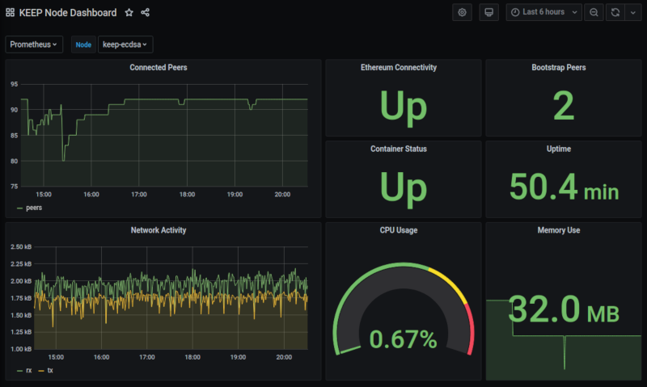

KEEP Grafana Dashboard
======================

This repository holds `jsonnet` configuration for the KEEP Grafana dashboard

The dashboard provides a simple overview of your node. You may wish to override values within this dashboard to suit you needs



## Install

Make sure you have the `GRAFANA_URL` environment variable set to your Grafana instance then you can deploy with [`grizzly`](https://github.com/grafana/grizzly)

```
grr apply keep-dashboard.jsonnet
```

You should then see the dashboard listed in your Grafana instance under KEEP